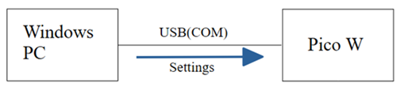
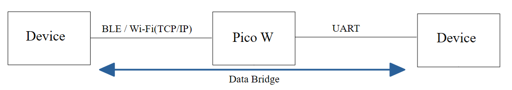

# PicoBrg Manual

## Table of Contents

- [Terms of Use](#terms-of-use)
- [Overview](#overview)
  - [System Configuration](#system-configuration)
- [Contents](#contents)
  - [Firmware (FW)](#firmware-fw)
  - [PC App](#pc-app)
- [Setup](#setup)
  - [Writing FW to Pico W](#writing-fw-to-pico-w)
  - [PC Setup](#pc-setup)
- [LED](#led)
  - [LED Status](#led-status)
- [Pins Used](#pins-used)
  - [Pins Used for UART](#pins-used-for-uart)
- [BLE UUIDs](#ble-uuids)
- [Default Settings](#default-settings)
- [Various Settings Using the PC App](#various-settings-using-the-pc-app)
  - [Starting PicoJigApp](#starting-picojigapp)
  - [Communication Mode and Wi-Fi Settings](#communication-mode-and-wi-fi-settings)
  - [UART Settings](#uart-settings)
  - [Erasing Setting Data in Flash Memory](#erasing-setting-data-in-flash-memory)
- [Checking BLE to UART Conversion in BLE Mode](#checking-ble-to-uart-conversion-in-ble-mode)
  - [Using an Android Smartphone as a BLE Communication Partner](#using-an-android-smartphone-as-a-ble-communication-partner)
  - [Using an iPhone as a BLE Communication Partner](#using-an-iphone-as-a-ble-communication-partner)
  - [Notes on BLE to UART Conversion](#notes-on-ble-to-uart-conversion)
- [Checking Wi-Fi to UART Conversion in Wi-Fi Mode](#checking-wi-fi-to-uart-conversion-in-wi-fi-mode)

## Terms of Use

When using PicoBrg, please be sure to check the [Shiomachi Software Terms of Use](https://sites.google.com/view/shiomachisoft/%E5%88%A9%E7%94%A8%E8%A6%8F%E7%B4%84).

> **Disclaimer:**   
> Shiomachi Software (the creator) assumes no responsibility for any trouble, loss, or damage caused by the use of this software or by implementing the contents of this document.

## Overview

The microcontroller board uses Raspberry Pi Pico W.

PicoBrg is firmware that converts (bridges) communication in the following two modes.

### Communication Modes
- **BLE Mode**  
  BLE to UART conversion
- **Wi-Fi Mode**  
  Wi-Fi (TCP socket communication) to UART conversion

### System Configuration

PicoBrg consists of two phases: "Settings" via the PC app and actual "Bridge Communication".

#### 1. Configuration During Settings

Use the dedicated PC app to configure various settings for Pico W (Communication Mode, Wi-Fi, UART).

> **Note:**
> - Connect the PC and Pico W with a USB cable to configure the settings.
> - Various settings (Communication Mode, Wi-Fi, UART) are saved in the Flash memory inside Pico W, so they are retained even if the power is turned off after setting them once.

#### 2. Configuration During Bridge Communication

After the settings are completed, Pico W acts as a data bridge according to the configured communication mode.

> **Notes on Communication Modes:**
> - The default is BLE mode.
> - In BLE mode, Pico W operates as a BLE "Peripheral".
> - In Wi-Fi mode, Pico W can operate as either a "TCP Server" or a "TCP Client".

## Contents

### Firmware (FW)

- PicoBrg_`XXXXXXXX`.uf2  
  This is the firmware to write to Pico W (`XXXXXXXX` is the version date).

### PC App

- PicoJigApp Folder  
  Contains the binaries for the Windows app used to configure various settings (Communication Mode, Wi-Fi, UART).

## Setup

### Writing FW to Pico W

Below is the procedure for writing the FW to Pico W.

1. While pressing the white button (BOOTSEL button) on Pico W, connect Pico W to the PC with a USB cable.  
   The RPI-RP2 drive will then be recognized.

   !Drive Recognition

2. Drag and drop `PicoBrg_XXXXXXXX.uf2` into the RPI-RP2 drive.

   !File Drag

This completes the firmware writing.

* When writing is complete, Pico W will automatically restart and the firmware will boot (from the next time, it will boot just by turning on the power).

### PC Setup

1. Copy the entire `PicoJigApp` folder to a suitable location on your PC (such as the desktop).
2. Check the version of the `.NET Framework`.  
   **In a Windows environment, `.NET Framework 4.6.2` or higher (4.x.x) must be enabled.**  
   It is not compatible with `.NET 5` or higher.
   
   > **Caution:**  
   > Enable the `.NET Framework` at your own risk.    
   > However, on Windows 11 and Windows 10 with the latest updates applied, `.NET Framework 4.8` is enabled by default, so you basically do not need to change the settings.
   
   You can check if `.NET Framework 4.8` is enabled on Windows by following the steps below.  
   Open **Control Panel** > **Programs** > **Turn Windows features on or off**.

   !Turn Windows features on or off

   => Ensure that the checkbox for `.NET Framework 4.8` is solid blue.

## LED

### LED Status

#### In BLE Mode

- If Pico W is not connected to a Central, the LED flashes at 500ms intervals.
- If Pico W is connected to a Central, the LED stops flashing and turns on solidly.

#### In Wi-Fi Mode

- If Pico W is not connected to a Wi-Fi router, the LED flashes at 500ms intervals.
- If Pico W is connected to a Wi-Fi router, the LED stops flashing and turns on solidly.

## Pins Used

### Pins Used for UART

The Pico W pins used for UART are as follows.

| Function | Pico W Pin |
| :--- | :--- |
| UART0 TX | GP0 (Pin 1) |
| UART0 RX | GP1 (Pin 2) |

## BLE UUIDs

The Nordic UART Service (NUS) is used for BLE communication.

- **Service UUID (GATT & Advertise)**  
  `6E400001-B5A3-F393-E0A9-E50E24DCCA9E`
- **Characteristic UUID (Write: BLE -> UART)**  
  `6E400002-B5A3-F393-E0A9-E50E24DCCA9E`
- **Characteristic UUID (Notify: UART -> BLE)**  
  `6E400003-B5A3-F393-E0A9-E50E24DCCA9E`

## Default Settings

| Setting Item | Default Value |
| :--- | :--- |
| **Mode** | BLE Mode |
| **Baud Rate** | 9600bps |
| **Data Bits** | 8 |
| **Stop Bits** | 1 |
| **Parity** | None |

## Various Settings Using the PC App

### Starting PicoJigApp

#### Main Screen

!Main Screen

#### Startup and Connection

1. Connect Pico W to the PC with a USB cable, wait for about 10 seconds, and then double-click `PicoJigApp.exe` in the `PicoJigApp` folder.  
   > **Note:**   
   > Waiting for about 10 seconds is because it takes time for Windows to recognize Pico W's virtual COM.  
   Double-clicking `PicoJigApp.exe` displays the main screen.
2. Leave the [USB Mode] radio button in [1] on the <Main Screen> ON.
3. Select the Pico W COM number in [2] on the <Main Screen> and press the [3] button.  
   If the display in [4] on the <Main Screen> changes to `connected`, it is successfully connected to Pico W.

When the display in [4] on the <Main Screen> changes to `connected`, the buttons in area [5] ([NW Config], [UART]) and button [6] on the <Main Screen> become enabled.

### Communication Mode and Wi-Fi Settings

#### Network Settings Screen

The Network Settings screen is displayed when you press the [NW Config] button in [5] on the <Main Screen>.

!Network Settings Screen

1. Select the communication mode with the radio buttons in [1].
   
   *** The following settings are required only for Wi-Fi mode.**  

2. Enter the IP address of Pico W in the box [2].  
   - Example: If you want to set the Pico W IP address to `192.168.10.100`
     - `192.168.10.100`
   
   *** The socket port number is fixed at `7777`.**

3. Enter the SSID of the Wi-Fi router in the box [3].
   > **SSID Conditions:**
   > - It must support the Wi-Fi standard "IEEE 802.11b/g/n" using the 2.4GHz band (5GHz band is not supported).
   > - The encryption method must be WPA2.
4. Enter the password of the Wi-Fi router in the box [4].
5. Select whether Pico W will be a TCP server or TCP client with the radio buttons in [5].
6. If you selected TCP client, enter the IP address of the destination TCP server in the box [6].
7. Pressing the button [7] configures the communication mode and Wi-Fi settings.

### UART Settings

#### UART Screen

The UART screen is displayed when you press the [UART] button in [5] on the <Main Screen>.

!UART Screen

You can change the UART settings by following the steps below.

1. Select the baud rate in [1].
2. Select the stop bit in [2].
3. Select the parity in [3].   
   *** The data bit is fixed at `8`.**
4. Press the button [4].  
   Pressing the button [4] configures the UART settings.

### Erasing Setting Data in Flash Memory

The following setting data is saved in Pico W's Flash memory.

- Communication Mode Settings
- Wi-Fi Settings
- UART Settings

> **Note:**       
> If you stop using PicoBrg or want to initialize it, we recommend erasing the setting data in the Flash memory with the button [6] on the <Main Screen>.

## Checking BLE to UART Conversion in BLE Mode

### Using an Android Smartphone as a BLE Communication Partner

> **Prerequisite:**  
> - Use the "Raspberry Pi Debug Probe", which has a USB (COM) to UART bridge function, as the UART communication partner.

#### Preparation

1. Use the PC app to set Pico W to BLE mode.
2. Install the "Serial Bluetooth Terminal" app on your Android smartphone.  
   *** Please install at your own risk.**
3. Install Tera Term on your Windows PC.  
   *** Please install at your own risk.**
4. Connect the pins of the Raspberry Pi Debug Probe as follows:
   - Raspberry Pi Debug Probe UART TX  
     -> Connect to Pico W UART0 RX = GP1 = Pin 2
   - Raspberry Pi Debug Probe UART RX  
     -> Connect to Pico W UART0 TX = GP0 = Pin 1
5. Connect the Raspberry Pi Debug Probe to your PC with a USB cable.

#### Procedure

1. Turn on the power of Pico W.
2. Launch Tera Term and connect it to the serial port (COM number) of the Raspberry Pi Debug Probe.
3. Configure the Tera Term serial port settings.  
   Match them to Pico W's UART settings (Pico W's default UART settings are as follows).
   - Baud Rate: 9600bps
   - Data Bits: 8
   - Stop Bits: 1
   - Parity: None
4. Launch Serial Bluetooth Terminal on your smartphone.

   *** From here on, unless otherwise noted, operations are performed on the Serial Bluetooth Terminal.**
5. Press "Devices" from the menu.
6. Press the "Bluetooth LE" tab.
7. Press "SCAN".  
   => `PicoBrg` will be displayed.
8. Press `PicoBrg`.

**[BLE -> UART]**  

1. Send some data from the Serial Bluetooth Terminal.  
   => The BLE -> UART converted data will be displayed in Tera Term.

**[UART -> BLE]**  

1. Send some data from Tera Term.  
   => The UART -> BLE converted data will be displayed in the Serial Bluetooth Terminal.

### Using an iPhone as a BLE Communication Partner

> **Prerequisite:**  
> - Use the "Raspberry Pi Debug Probe", which has a USB (COM) to UART bridge function, as the UART communication partner.

#### Preparation

1. Use the PC app to set Pico W to BLE mode.
2. Install the "LightBlue" app on your iPhone.  
   *** Please install at your own risk.**
3. Install Tera Term on your Windows PC.  
   *** Please install at your own risk.**
4. Connect the pins of the Raspberry Pi Debug Probe as follows:
   - Raspberry Pi Debug Probe UART TX  
     -> Connect to Pico W UART0 RX = GP1 = Pin 2
   - Raspberry Pi Debug Probe UART RX  
     -> Connect to Pico W UART0 TX = GP0 = Pin 1
5. Connect the Raspberry Pi Debug Probe to your PC with a USB cable.

#### Procedure

1. Turn on the power of Pico W.
2. Launch Tera Term and connect it to the serial port (COM number) of the Raspberry Pi Debug Probe.
3. Configure the Tera Term serial port settings.  
   Match them to Pico W's UART settings (Pico W's default UART settings are as follows).
   - Baud Rate: 9600bps
   - Data Bits: 8
   - Stop Bits: 1
   - Parity: None
4. Launch LightBlue on your iPhone.
 
   *** From here on, unless otherwise noted, operations are performed on LightBlue.**
5. Select `PicoBrg` from the list of advertising devices and press "Connect".  
   => The UUID list will be displayed.

**[BLE -> UART]**  

1. In the UUID list, press the UUID whose Properties are `Write`.
2. Press "Write new value".
3. Enter the data you want to send and press "Send".
   > **Note:**    
   > For example, if you want to send the string `AB`, you need to enter `4142` (in hex notation of ASCII code).  
   
   => The BLE -> UART converted data will be displayed in Tera Term.

**[UART -> BLE]**  

1. In the UUID list, press the UUID whose Properties are `Notify`.
2. Press "Subscribe".
3. Send some data from Tera Term.  
   => The UART -> BLE converted data will be displayed in LightBlue.  
   (* The data will be displayed in hexadecimal binary)

### Notes on BLE to UART Conversion

> **Caution:**  
> The actual communication rate of BLE varies depending on the communication partner and distance.
> Therefore, considering the case where the BLE communication rate drops, it is recommended to set the UART baud rate to a lower value such as 9600bps or 4800bps.

## Checking Wi-Fi to UART Conversion in Wi-Fi Mode

> **Prerequisite:**  
> - Use the "Raspberry Pi Debug Probe", which has a USB (COM) to UART bridge function, as the UART communication partner.
> - Set Pico W as a TCP server.
> - Use Tera Term as a TCP client.

### Preparation

1. Use the PC app to set Pico W to Wi-Fi mode.
2. Next, configure the Wi-Fi settings.  
   (* At this time, set Pico W as a TCP server)
3. Confirm that the LED of Pico W has changed from flashing to solid.  
   (* When it is solid, Pico W is connected to the Wi-Fi router)
4. Install Tera Term on your Windows PC.  
   *** Please install at your own risk.**
5. Connect the pins of the Raspberry Pi Debug Probe as follows:
   - Raspberry Pi Debug Probe UART TX  
     -> Connect to Pico W UART0 RX = GP1 = Pin 2
   - Raspberry Pi Debug Probe UART RX  
     -> Connect to Pico W UART0 TX = GP0 = Pin 1
6. Connect the Raspberry Pi Debug Probe to your PC with a USB cable.

### Procedure

1. Turn on the power of Pico W.
2. Launch Tera Term for TCP communication.
3. Configure Tera Term for TCP communication as shown in the figure below.  
   * For the IP address in the figure below, specify the IP address of Pico W configured in the Wi-Fi settings.

   !Tera Term1
   !Tera Term2

4. Separately, launch Tera Term for COM communication and connect it to the serial port (COM number) of the Raspberry Pi Debug Probe.
5. Configure the serial port settings for Tera Term for COM communication.  
   Match them to Pico W's UART settings (Pico W's default UART settings are as follows).
   - Baud Rate: 9600bps
   - Data Bits: 8
   - Stop Bits: 1
   - Parity: None

**[Wi-Fi -> UART]**  

1. In Tera Term for TCP communication, enter the string you want to send via TCP from Tera Term to Pico W, then press the Enter key.
   !Tera Term3
   => The Wi-Fi -> UART converted data will be displayed in Tera Term for COM communication.

**[UART -> Wi-Fi]**  

1. Send some data from Tera Term for COM communication.  
   => The UART -> Wi-Fi converted data will be displayed in Tera Term for TCP communication.  