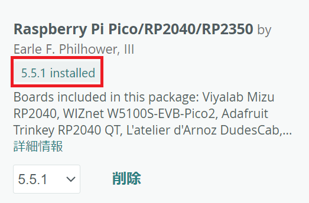
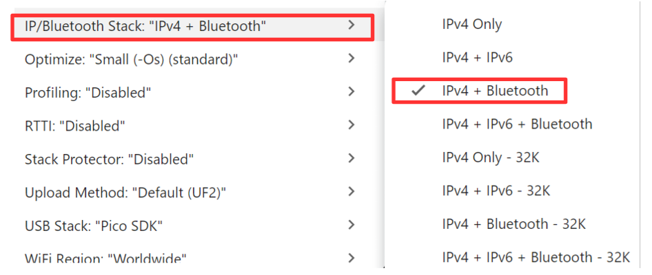

# How to Build the FW

- Install the following version of Arduino IDE on Windows.

   - arduino-ide_2.3.8_Windows_64bit.exe

- Copy the PicoBrg folder inside the src_fw folder to a suitable location on your PC.

- Open PicoBrg.ino in the PicoBrg folder with the Arduino IDE.

- Go to "File" -> "Preferences", and enter the following in "Additional Boards Manager URLs".

https://github.com/earlephilhower/arduino-pico/releases/download/global/package_rp2040_index.json

- Install the following Boards Manager.

  - * Just to be sure, match the version as well.

- Selecting the Board and Port

  - Board: Select "Tools" -> "Board" -> "Raspberry Pi Pico/RP2040/RP2350" -> "Raspberry Pi Pico W".
  - Port: After connecting Pico W to the PC via USB, select "Tools" -> "Port" -> the COM port number of Pico W.

- Selecting the "IP/Bluetooth Stack"

  - Select "Tools" -> "IP/Bluetooth Stack" -> "IPv4 + Bluetooth".

- Execute "Sketch" -> "Verify/Compile".