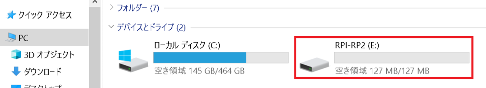
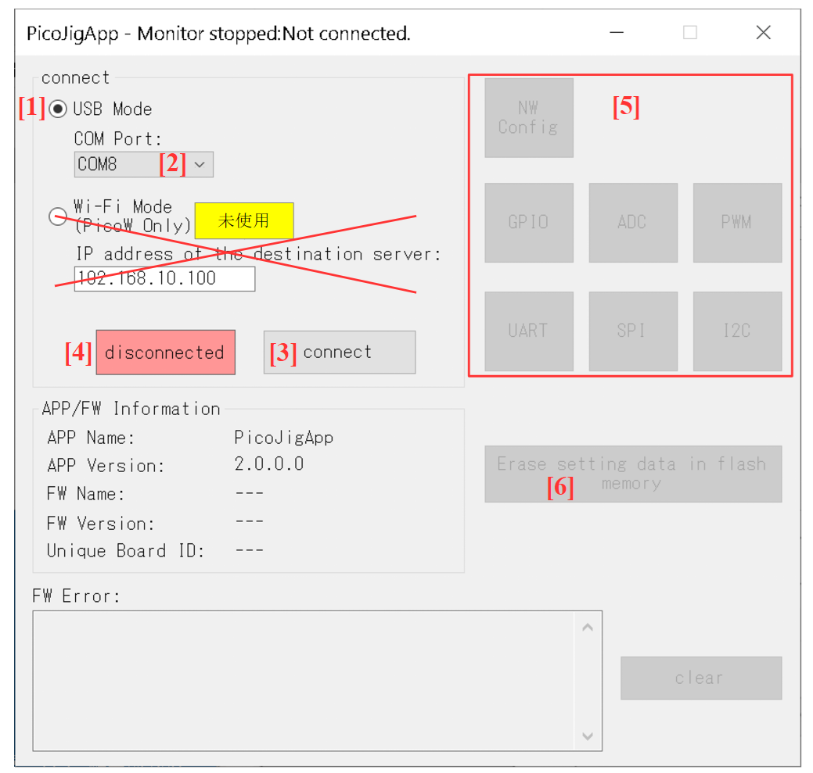
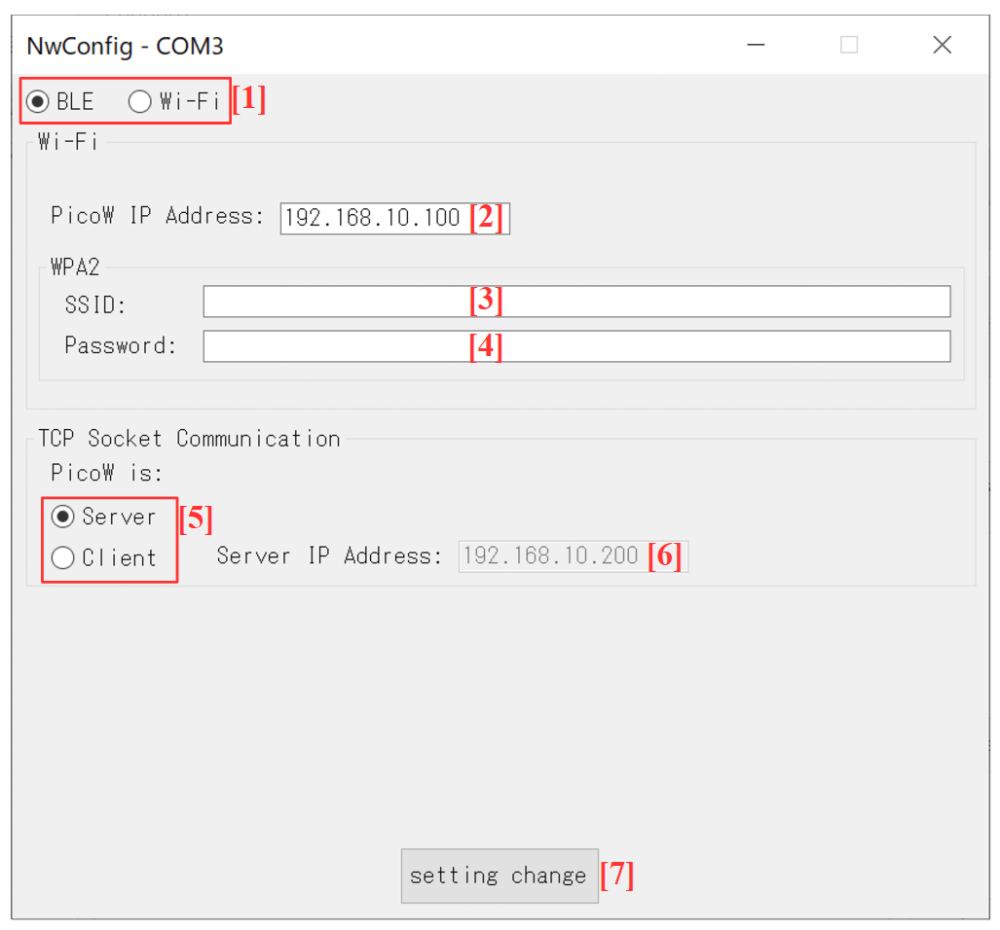
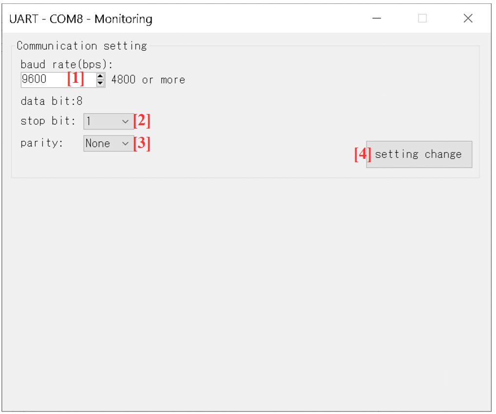
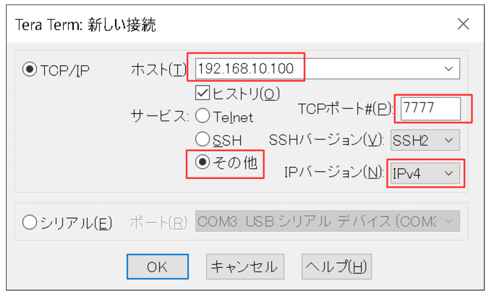
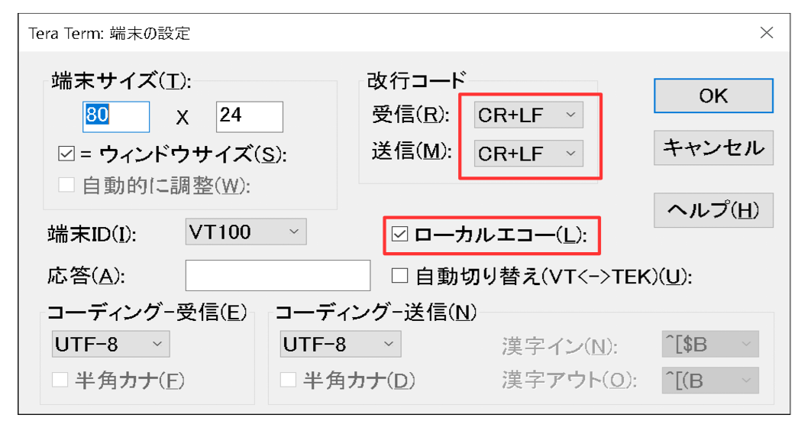
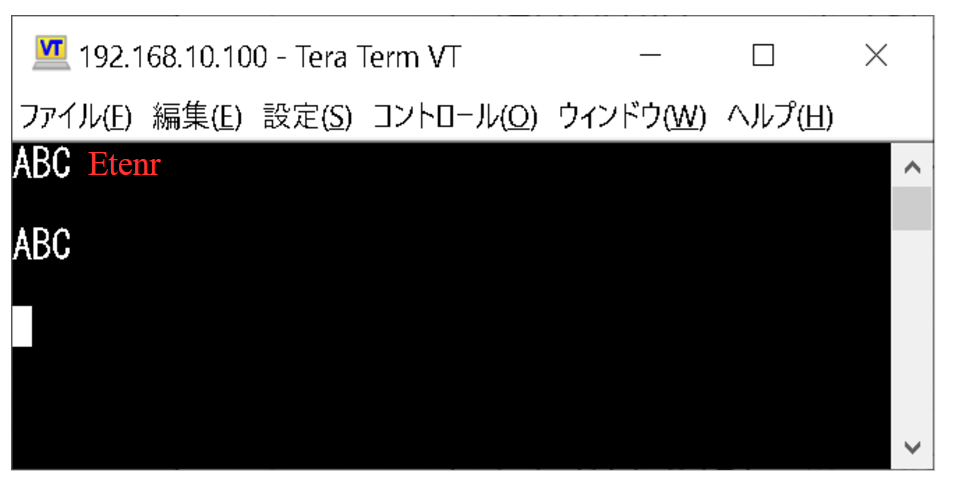

# PicoBrgマニュアル

## 目次

- [利用規約](#利用規約)
- [概要](#概要)
  - [システム構成](#システム構成)
- [内容物](#内容物)
  - [ファームウェア（FW）](#ファームウェアfw)
  - [PCアプリ](#pcアプリ)
- [セットアップ](#セットアップ)
  - [Pico WにFWを書き込む](#pico-wにfwを書き込む)
  - [PC側のセットアップ](#pc側のセットアップ)
- [LED](#led)
  - [LED点灯内容](#led点灯内容)
- [使用ピン](#使用ピン)
  - [UARTで使用するピン](#uartで使用するピン)
- [BLEのUUID](#bleのuuid)
- [デフォルト設定](#デフォルト設定)
- [PCアプリを使用した各種設定](#pcアプリを使用した各種設定)
  - [PicoJigAppの起動](#picojigappの起動)
  - [通信モード・Wi-Fi設定](#通信モードwi-fi設定)
  - [UART設定](#uart設定)
  - [Flashメモリ内の設定データの消去](#flashメモリ内の設定データの消去)
- [BLEモードのBLE⇔UART変換を確認する](#bleモードのbleuart変換を確認する)
  - [BLEの通信相手としてAndroidのスマホを使用する場合](#bleの通信相手としてandroidのスマホを使用する場合)
  - [BLEの通信相手としてiPhoneを使用する場合](#bleの通信相手としてiphoneを使用する場合)
  - [BLE⇔UART変換の注意](#bleuart変換の注意)
- [Wi-FiモードのWi-Fi⇔UART変換を確認する](#wi-fiモードのwi-fiuart変換を確認する)

## 利用規約

PicoBrgを使用する際は、必ず[塩町ソフトウェアの利用規約](https://sites.google.com/view/shiomachisoft/%E5%88%A9%E7%94%A8%E8%A6%8F%E7%B4%84)をご確認ください。

> **免責事項:**   
> 本ソフトウェアの使用、または本書の内容を実施したことにより生じたいかなるトラブル・損失・損害についても、塩町ソフトウェア（作成者）は一切の責任を負いません。

## 概要

マイコン基板はRaspberry Pi Pico Wを使用します。

PicoBrgは、下記の2つのモードで通信の変換（ブリッジ）を行うファームウェアです。

### 通信モード
- **BLEモード**  
  BLE ⇔ UART の変換
- **Wi-Fiモード**  
  Wi-Fi（TCPソケット通信） ⇔ UART の変換

### システム構成

PicoBrgは、PCアプリによる「設定」と、実際の「ブリッジ通信」の2つのフェーズで構成されています。

#### 1. 設定時の構成

専用のPCアプリを使用して、Pico Wの各種設定（通信モード・Wi-Fi・UART）を行います。

> **補足:**
> - PCとPico WをUSBケーブルで接続して設定を行います。
> - 各種設定（通信モード、Wi-Fi、UART）はPico W内のFlashメモリに保存されるため、一度設定すれば電源を切っても保持されます。

#### 2. ブリッジ通信時の構成

設定完了後、Pico Wは設定された通信モードに従ってデータの橋渡し（ブリッジ）を行います。

> **通信モードの補足:**
> - デフォルトはBLEモードです。
> - BLEモードの場合、Pico WはBLEの「ペリフェラル」として動作します。
> - Wi-Fiモードの場合、Pico Wは「TCPサーバー」と「TCPクライアント」のどちらかとして動作可能です。

## 内容物

### ファームウェア（FW）

- PicoBrg_`XXXXXXXX`.uf2  
  Pico Wに書き込むファームウェアです（`XXXXXXXX` はバージョン日付）。

### PCアプリ

- PicoJigAppフォルダ  
  各種設定（通信モード・Wi-Fi・UART）を行うWindows用アプリのバイナリが含まれます。

## セットアップ

### Pico WにFWを書き込む

以下は、Pico WにFWを書き込む手順です。

1. Pico Wの白いボタン（BOOTSELボタン）を押しながら、Pico WをPCにUSBケーブルで接続します。  
   すると、RPI-RP2のドライブが認識されます。

   

2. RPI-RP2ドライブの中に `PicoBrg_XXXXXXXX.uf2` をドラッグ＆ドロップします。

   

以上で、ファームウェアの書き込みは完了です。

※書き込みが完了するとPico Wは自動的に再起動し、ファームウェアが起動します（次回以降は電源を入れるだけで起動します）。

### PC側のセットアップ

1. `PicoJigApp`フォルダをPCの適当な場所（デスクトップなど）にフォルダごとコピーしてください。
2. `.NET Framework` のバージョンを確認します。  
   **Windows環境において、 `.NET Framework 4.6.2` 以上（4.x.x）が有効になっている必要があります。**  
   `.NET 5` 以上とは互換性がありません。
   
   > **注意:**  
   > `.NET Framework` の有効化は自己責任で行ってください。    
   > ただし、Windows 11および最新の更新が適用されたWindows 10では、デフォルトで `.NET Framework 4.8` が有効になっているため、基本的に設定を変更する必要はありません。
   
   Windowsで `.NET Framework 4.8` が有効になっているかどうかは、以下の手順で確認できます。  
   **コントロールパネル** > **プログラム** > **Windowsの機能の有効化または無効化** を開きます。

   

   ⇒ `.NET Framework 4.8` のチェックボックスが青色の状態になっていることを確認してください。

## LED

### LED点灯内容

#### BLEモードの場合

- Pico Wがセントラルと接続されていない場合、LEDは500ms間隔で点滅します。
- Pico Wがセントラルと接続された場合、LEDは点滅ではなく点灯になります。

#### Wi-Fiモードの場合

- Pico WがWi-Fiルーターと接続されていない場合、LEDは500ms間隔で点滅します。
- Pico WがWi-Fiルーターと接続された場合、LEDは点滅ではなく点灯になります。

## 使用ピン

### UARTで使用するピン

UARTで使用するPico Wのピンは以下の通りです。

| 機能 | Pico Wのピン |
| :--- | :--- |
| UART0 TX | GP0（1番ピン） |
| UART0 RX | GP1（2番ピン） |

## BLEのUUID

BLE通信には、Nordic UART Service (NUS) を使用しています。

- **サービスUUID（GATT & Advertise）**  
  `6E400001-B5A3-F393-E0A9-E50E24DCCA9E`
- **Characteristic UUID（Write:BLE→UART）**  
  `6E400002-B5A3-F393-E0A9-E50E24DCCA9E`
- **Characteristic UUID（Notify:UART→BLE）**  
  `6E400003-B5A3-F393-E0A9-E50E24DCCA9E`

## デフォルト設定

| 設定項目 | デフォルト値 |
| :--- | :--- |
| **モード** | BLEモード |
| **ボーレート** | 9600bps |
| **データビット** | 8 |
| **ストップビット** | 1 |
| **パリティ** | 無し |

## PCアプリを使用した各種設定

### PicoJigAppの起動

#### メイン画面

#### 起動と接続

1. Pico WをPCにUSBケーブルで接続し、10秒程度待機してから `PicoJigApp` フォルダの中の `PicoJigApp.exe` をダブルクリックします。  
   > **補足:**   
   > 10秒程度待機するのは、WindowsがPico Wの仮想COMを認識するのに時間がかかるためです。  
   `PicoJigApp.exe`をダブルクリックすると、メイン画面が表示されます。
2. [メイン画面]の[1]にある[USB Mode]ラジオボタンをONのままにします。
3. [メイン画面]の[2]でPico WのCOM番号を選択し、[3]のボタンを押します。  
   [メイン画面]の[4]の表示が `connected` に変わっていればPico Wと接続できています。

[メイン画面]の[4]の表示が `connected` に変わると、[メイン画面]の[5]エリアにあるボタン（[NW Config]、[UART]）と、[6]のボタンが有効になります。

### 通信モード・Wi-Fi設定

#### ネットワーク設定画面

ネットワーク設定画面は、[メイン画面]の[5]にある[NW Config]ボタンを押すと表示されます。

1. [1]のラジオボタンで通信モードを選択します。
   
   **※以降は、Wi-Fiモードの場合のみ必要な設定です。**  

2. [2]のボックスにPico WのIPアドレスを入力します。  
   - 例: Pico WのIPアドレスを `192.168.10.100` に設定したい場合
     - `192.168.10.100`
   
   **※ソケットポート番号は `7777` 固定です。**

3. [3]のボックスにWi-FiルーターのSSIDを入力します。
   > **SSIDの条件:**
   > - 2.4GHz帯を使用するWi-Fi規格「IEEE 802.11b/g/n」に対応していること（5GHz帯は不可）。
   > - 暗号化方式はWPA2であること。
4. [4]のボックスにWi-Fiルーターのパスワードを入力します。
5. [5]のラジオボタンで、Pico WをTCPサーバーにするかTCPクライアントにするかを選択します。
6. TCPクライアントを選択した場合は、[6]のボックスに接続先のTCPサーバーのIPアドレスを入力します。
7. [7]のボタンを押すと、通信モード設定とWi-Fi設定が行われます。

### UART設定

#### UART画面

UART画面は、[メイン画面]の[5]にある[UART]ボタンを押すと表示されます。

以下の手順でUARTの設定を変更できます。

1. [1]でボーレートを選択します。
2. [2]でストップビットを選択します。
3. [3]でパリティを選択します。   
   **※データビットは `8` 固定です。**
4. [4]のボタンを押します。  
   [4]のボタンを押すと、UART設定が行われます。

### Flashメモリ内の設定データの消去

Pico WのFlashメモリ内には、以下の設定データが保存されています。

- 通信モード設定
- Wi-Fi設定
- UART設定

> **補足:**       
> PicoBrgを使用しなくなった場合や初期化したい場合は、[メイン画面]の[6]のボタンでFlashメモリ内の設定データを消去することをお勧めします。

## BLEモードのBLE⇔UART変換を確認する

### BLEの通信相手としてAndroidのスマホを使用する場合

> **前提:**  
> - UARTの通信相手として、USB（COM）⇔UARTブリッジ機能を持つ「Raspberry Pi デバッグプローブ」を使用します。

#### 事前準備

1. PCアプリを使用して、Pico WをBLEモードに設定します。
2. Androidスマホに、「Serial Bluetooth Terminal」のアプリをインストールします。  
   **※インストールは自己責任で行ってください。**
3. Windows PCにTera Termをインストールします。  
   **※インストールは自己責任で行ってください。**
4. Raspberry Pi デバッグプローブを下記の通りにピンを接続します。
   - Raspberry Pi デバッグプローブのUART TX  
     →Pico WのUART0 RX=GP1=2番ピンに接続します
   - Raspberry Pi デバッグプローブのUART RX  
     →Pico WのUART0 TX=GP0=1番ピンに接続します
5. Raspberry Pi デバッグプローブをPCにUSBケーブルで接続します。

#### 手順

1. Pico Wの電源をONにします。
2. Tera Termを起動し、Raspberry Pi デバッグプローブのシリアルポート（COM番号）と接続します。
3. Tera Termのシリアルポート設定を行います。  
   Pico WのUART設定に合わせてください（Pico WのUARTデフォルト設定は以下の通りです）。
   - ボーレート: 9600bps
   - データビット: 8
   - ストップビット: 1
   - パリティ: 無し
4. スマホ上でSerial Bluetooth Terminalを起動します。

   **※以降、特記が無い限り、Serial Bluetooth Terminal上での操作となります。**
5. メニューから「Devices」を押します。
6. 「Bluetooth LE」タブを押します。
7. 「SCAN」を押します。  
   ⇒ `PicoBrg` が表示されます。
8. `PicoBrg` を押します。

**【BLE→UART】**  

1. Serial Bluetooth Terminalから何かデータを送ります。  
   ⇒ Tera Termに、BLE→UART変換されたデータが表示されます。

**【UART→BLE】**  

1. Tera Termから何かデータを送ります。  
   ⇒ Serial Bluetooth Terminalに、UART→BLE変換されたデータが表示されます。

### BLEの通信相手としてiPhoneを使用する場合

> **前提:**  
> - UARTの通信相手として、USB（COM）⇔UARTブリッジ機能を持つ「Raspberry Pi デバッグプローブ」を使用します。

#### 事前準備

1. PCアプリを使用して、Pico WをBLEモードに設定します。
2. iPhoneに、「LightBlue」のアプリをインストールします。  
   **※インストールは自己責任で行ってください。**
3. Windows PCにTera Termをインストールします。  
   **※インストールは自己責任で行ってください。**
4. Raspberry Pi デバッグプローブを下記の通りにピンを接続します。
   - Raspberry Pi デバッグプローブのUART TX  
     →Pico WのUART0 RX=GP1=2番ピンに接続します
   - Raspberry Pi デバッグプローブのUART RX  
     →Pico WのUART0 TX=GP0=1番ピンに接続します
5. Raspberry Pi デバッグプローブをPCにUSBケーブルで接続します。

#### 手順

1. Pico Wの電源をONにします。
2. Tera Termを起動し、Raspberry Pi デバッグプローブのシリアルポート（COM番号）と接続します。
3. Tera Termのシリアルポート設定を行います。  
   Pico WのUART設定に合わせてください（Pico WのUARTデフォルト設定は以下の通りです）。
   - ボーレート: 9600bps
   - データビット: 8
   - ストップビット: 1
   - パリティ: 無し
4. iPhone上でLightBlueを起動します。
 
   **※以降、特記が無い限り、LightBlue上での操作となります。**
5. アドバタイズしているデバイスの一覧から `PicoBrg` を選択し、「Connect」を押します。  
   ⇒ UUID一覧が表示されます。

**【BLE→UART】**  

1. UUID一覧の中で、Propertiesが `Write` となっているUUIDを押します。
2. 「Write new value」を押します。
3. 送信したいデータを入力して「Send」を押します。
   > **補足:**    
   > 例として、文字列 `AB` を送信したい場合は、`4142` （ASCIIコードの16進数表記で）と入力する必要があります。  
   
   ⇒ Tera Termに、BLE→UART変換されたデータが表示されます。

**【UART→BLE】**  

1. UUID一覧の中で、Propertiesが `Notify` となっているUUIDを押します。
2. 「Subscribe」を押します。
3. Tera Termから何かデータを送ります。  
   ⇒ LightBlueに、UART→BLE変換されたデータが表示されます。  
   （※データが16進数バイナリで表示されます）

### BLE⇔UART変換の注意

> **注意:**  
> BLEの実際の通信レートは、通信相手や通信距離によって変動します。
> そのため、BLEの通信レートが低下した場合を考慮し、UARTのボーレートは9600bpsや4800bpsなどの低めの値に設定することを推奨します。

## Wi-FiモードのWi-Fi⇔UART変換を確認する

> **前提:**  
> - UARTの通信相手として、USB（COM）⇔UARTブリッジ機能を持つ「Raspberry Pi デバッグプローブ」を使用します。
> - Pico WをTCPサーバーに設定します。
> - Tera TermをTCPクライアントとして使用します。

### 事前準備

1. PCアプリを使用して、Pico WをWi-Fiモードに設定します。
2. 続けてWi-Fi設定を行います。  
   （※この時、Pico WはTCPサーバーに設定してください）
3. Pico WのLEDが点滅から点灯に変わったことを確認します。  
   （※点灯状態になると、Pico WがWi-Fiルーターと接続できています）
4. Windows PCにTera Termをインストールします。  
   **※インストールは自己責任で行ってください。**
5. Raspberry Pi デバッグプローブを下記の通りにピンを接続します。
   - Raspberry Pi デバッグプローブのUART TX  
     →Pico WのUART0 RX=GP1=2番ピンに接続します
   - Raspberry Pi デバッグプローブのUART RX  
     →Pico WのUART0 TX=GP0=1番ピンに接続します
6. Raspberry Pi デバッグプローブをPCにUSBケーブルで接続します。

### 手順

1. Pico Wの電源をONにします。
2. TCP通信用のTera Termを起動します。
3. TCP通信用のTera Termについて、下図の通り設定します。  
   ※下図中のIPアドレスには、Wi-Fi設定で設定したPico WのIPアドレスを指定します。

   
   

4. 別途、COM通信用のTera Termを起動し、Raspberry Pi デバッグプローブのシリアルポート（COM番号）と接続します。
5. COM通信用のTera Termのシリアルポート設定を行います。  
   Pico WのUART設定に合わせてください（Pico WのUARTデフォルト設定は以下の通りです）。
   - ボーレート: 9600bps
   - データビット: 8
   - ストップビット: 1
   - パリティ: 無し

**【Wi-Fi→UART】**  

1. TCP通信用のTera Termにおいて、Tera TermからPico WにTCP送信したい文字列を入力した後、Enterキーを押します。
   
   ⇒ COM通信用のTera Termに、Wi-Fi→UART変換されたデータが表示されます。

**【UART→Wi-Fi】**  

1. COM通信用のTera Termから何かデータを送ります。  
   ⇒ TCP通信用のTera Termに、UART→Wi-Fi変換されたデータが表示されます。  