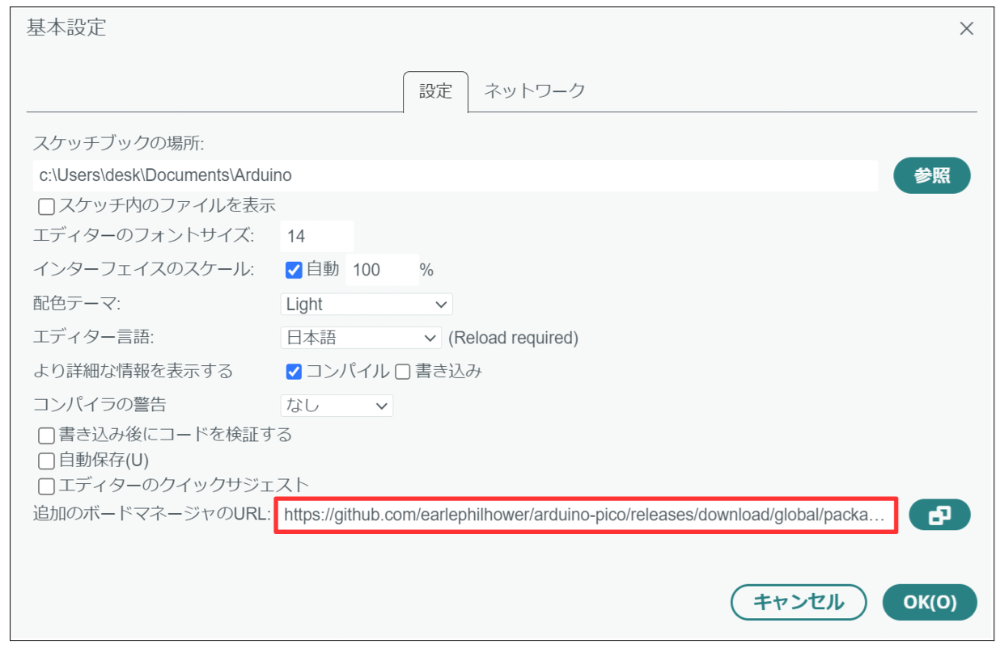
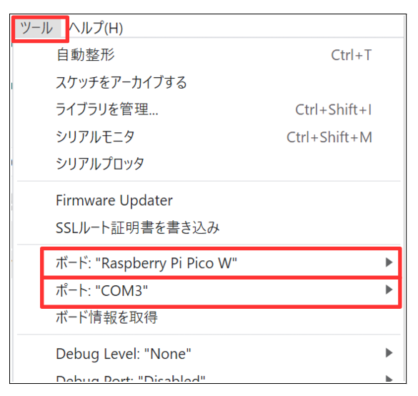

# FWビルド方法

- 下記のバージョンのArduino IDEをWindowsにインストールします。

  - arduino-ide_2.3.8_Windows_64bit.exe

- src_fwフォルダ内のPicoBrgフォルダをPCの適当な場所にコピーします。

- PicoBrgフォルダ内のPicoBrg.inoをArduino IDEで開きます。

- 「ファイル」⇒「基本設定」で、「追加のボードマネージャのURL」に下記を入力します。

`https://github.com/earlephilhower/arduino-pico/releases/download/global/package_rp2040_index.json`

- 下記のボードマネージャをインストールします。

  - ※念のため、バージョンも合わせます。

- ボードとポートの選択

  - ボード：「ツール」⇒「ボード」⇒「Raspberry Pi Pico/RP2040/RP2350」⇒「Raspberry Pi Pico W」を選択します。
  - ポート：Pico WをPCにUSB接続後、「ツール」⇒「ポート」⇒Pico WのCOM番号を選択します。

- 「IP/Bluetooth Stack」の選択

  - 「ツール」⇒「IP/Bluetooth Stack」⇒「IPv4 + Bluetooth」を選択します。

- 「スケッチ」⇒「検証・コンパイル」を実行します。
